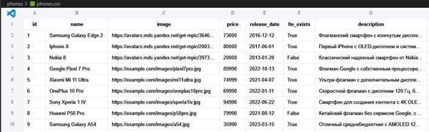
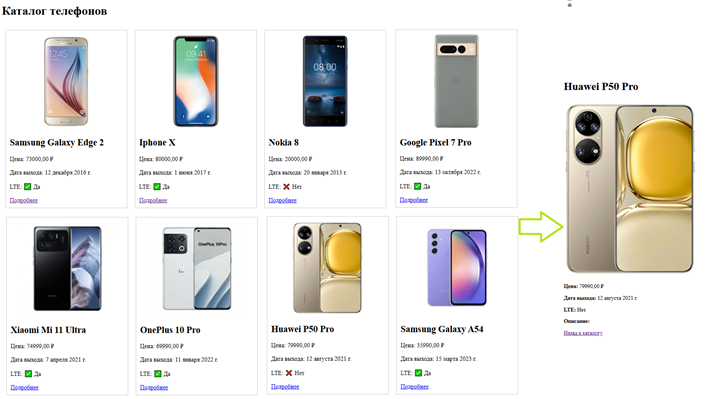

# Каталог телефонов — Django ORM 

Интернет-магазина телефонов с использованием **Django ORM**.  
Данные загружаются из CSV-файла и отображаются в виде каталога с карточками товаров и страницами детального просмотра.

Используется ORM Django:
- Создание моделей и миграций
- Импорт данных из CSV
- Настройка маршрутов (URLs)
- Работа с представлениями (views)
- Использование шаблонов (templates)
- Подключение к PostgreSQL

Цель: Создать сайт продажи телефонов
Исходные данные: csv-файл
 

Ожидаемый результат:
 
